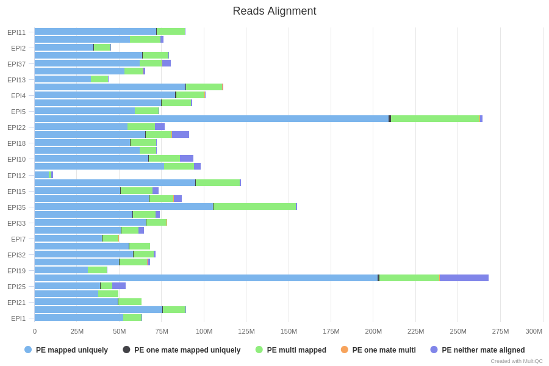
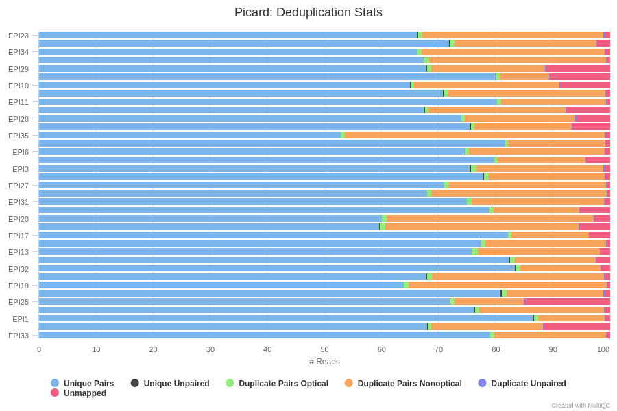
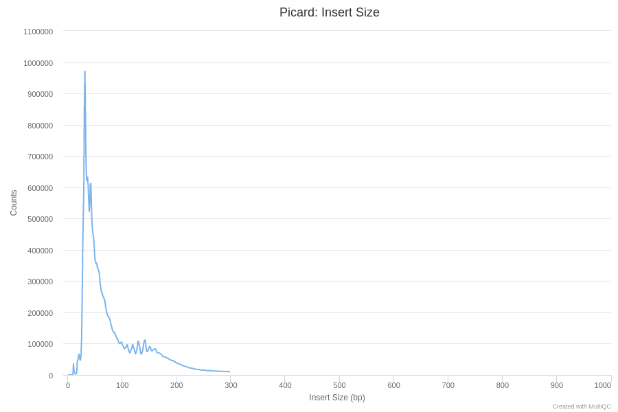
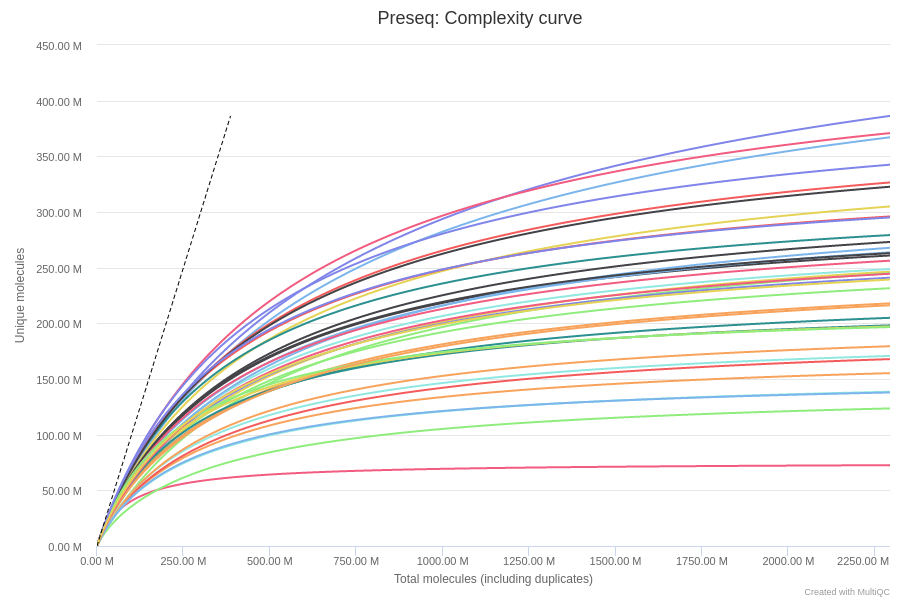
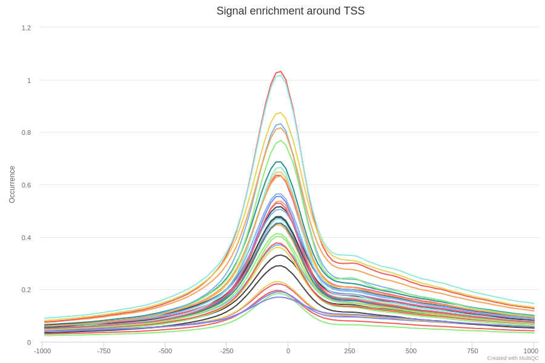

# Outputs

This document describes the output produced by the pipeline. Most of the plots are taken from the MultiQC report, which summarises results at the end of the pipeline.

## Pipeline overview
The pipeline is built using [Nextflow](https://www.nextflow.io/)
and processes ChIP-seq data using the steps presented in the main README file.  
Briefly, its goal is to process ChIP-seq data for any protocol, with or without control samples, and with or without spike-ins.

The directories listed below will be created in the output directory after the pipeline has finished. 

## Sequencing quality

### FastQC
[FastQC](http://www.bioinformatics.babraham.ac.uk/projects/fastqc/) gives general quality metrics about your reads. It provides information about the quality score distribution across your reads, the per base sequence content (%T/A/G/C). You get information about adapter contamination and other overrepresented sequences.

For further reading and documentation see the [FastQC help](http://www.bioinformatics.babraham.ac.uk/projects/fastqc/Help/).

**Output directory: `fastqc`**

* `sample_fastqc.html`
  * FastQC report, containing quality metrics for your untrimmed raw fastq files
* `zips/sample_fastqc.zip`
  * zip file containing the FastQC report, tab-delimited data file and plot images

## Reads mapping

### Alignment

Different tools can be used for read alignment (`BWA-mem`, `Bowtie2`). The mapping statistics (`Total Fragments`, `Aligned Reads`, `High-Quality Alignment`, `Low-Quality Alignment`) are also presented in the main summary table.

> **NB:** By default, we set a mapping quality to 20, meaning that alignments associated with multiple mapping sites should be discarded. If necessary, the `--mapq` option can be changed.

**Output directory: `mapping`**

* `sample.bam`
  * Aligned reads. Available only if (`--saveAlignedIntermediates`) is used.
* `sample_sorted.bam`
  * Aligned reads sorted by chromosome position. Available only if (`--saveAlignedIntermediates`) is used.
* `sample_sorted.bam.bai`
  * Index of aligned and sorted reads. Available only if (`--saveAlignedIntermediates`) is used.

The mapping statistics are presented in the MultiQC report as follows.  
In general, we expect more than 80% of aligned reads. Samples with less than 50% of mapped reads should be further investigated, and check for adapter content, contamination, etc.

## Reads Filtering

### Duplicates

[Picard MarkDuplicates](https://broadinstitute.github.io/picard/command-line-overview.html) is used to mark and remove the duplicates. 
The results are presented in the `General Metrics` table. Duplicate reads are **marked** by default from the aligned reads to mitigate for fragments in the library that may have been sequenced more than once due to PCR biases. By default, duplicates are then removed during the filtering step. There is an option to keep duplicate reads with the `--keepDups` parameter but its generally recommended to remove them to avoid any wrong interpretation of the results.	

**Output directory: `mapping`**

* `sample_marked.bam`
  * Aligned reads with marked duplicates only if (`--saveAlignedIntermediates`) is used.
* `sample_marked.bam.bai`
  * Index of aligned reads with marked duplicates
	
From our experience, an ATAC-seq sample with less than 25% of duplicates is usually of good quality. Samples with more than 50% of duplicates should be interpreted with caution.

### Alignment filtering

Before running any downstream analysis, aligned reads are filtered as follow:
- Low mapping quality reads are discarded (see `--mapq`).
- Reads aligned on blacklisted ENCODE regions are discarded (see the genome annotation for details).
- Duplicates reads are filtered by default. Use `--keepDups` to switch off this filter.
- Reads aligned to mitochondrial chromosome are filtered. Use `keepMito` to switch off this filter.
- Singleton reads are discarded and only valid pairs are considered. Use `--keepSingleton` to switch off this filter.

> **NB:** The fraction of reads aligned to mitochondrial chromosome is an important quality control of ATAC-seq experiments. For some cell types, this fraction can represent more than 50% of sequenced reads, and could therefore be an issue. Here, we considered that having less of 30% of mitochondrial reads is acceptable.

**Output directory: `mapping`**

* `sample_filtered.bam`
  * Aligned reads after all filtering steps.
* `sample_filtered.bam.bai`
  * Index of aligned and filtered reads

### Reads shifting

In ATAC-seq experiments, it is known that the transposase insertion leads to a 9bp offset. Briefly, Tn5 transposase binds to DNA as a homodimer with 9-bp of DNA between the two Tn5 molecules. Because of this, each Tn5 homodimer binding event creates two insertions, separated by 9 bp. Thus, the actual central point of the “accessible” site is in the very center of the Tn5 dimer, not the location of each Tn5 insertion. To account for this, we apply an offset to the individual Tn5 insertions, adjusting plus-stranded insertion events by +4 bp and minus-stranded insertion events by -5 bp ([source](https://www.archrproject.com/bookdown/a-brief-primer-on-atac-seq-terminology.html)).

Here, we use the [deepTools](https://deeptools.readthedocs.io/en/develop/content/list_of_tools.html) alignmentSieve function to therefore correct for this Tn5 offset. Note, that this step can be skipped using the `--skipShift` option.
In practice, for fragment level analysis and detection of open-chromatin genomic regions, this option has a very limited impact on the results.

**Output directory: `mapping`**

* `sample_filtered_shifted.bam`
  * Aligned reads after filtering and shifting steps.
* `sample_filtered_shifted.bam.bai`
  * Index of aligned, filtered and shifted reads

## Quality controls

From the filtered and aligned reads files, the pipeline then runs several quality control steps presented below.

### Fragment length distributions

Tn5 transposase preferentially inserts sequencing adaptors into chromatin regions of higher accessibility. It is always recommended to optimize the ratio of cell number and enzyme concentration to better capture in vivo chromatin accessibility profiles. Thus, the size distribution of sequenced fragments of ATAC-seq libraries is an important metric of quality assessment ([Ou et al. 2018](https://bmcgenomics.biomedcentral.com/articles/10.1186/s12864-018-4559-3)).

High quality ATAC-seq libraries generally contain about 50% of short fragments (< 100 bp), which represent nucleosome-free regions. The remaining reads from larger fragments therefore come from nucleosome-bound but open chromatin regions. The insert size distribution of all the fragments should show an obvious downward laddering pattern reflecting the amount and length of DNA fragments from nucleosome-free regions, and those associated with one to several nucleosomes ([source](https://bmcgenomics.biomedcentral.com/articles/10.1186/s12864-018-4559-3)). 

The results from picard CollectInsertSizeMetrics gives you a quick visualisation for fragment lengths distributions.

**Output directory: `fragSize`**

* `insert_size_histogram.pdf`,`insert_size_metrics.txt`: CollectInsertSizeMetrics output files

Here are a few examples of expected fragment size distribution.

Experiments with with a too high ratio of Tn5 transposase concentration to the number of cells (ie. over-transposition) usually leads to an increased background signals and reduced signal-to-noise ratio.

On the contrary, size distribution with a bias toward large fragment might have resulted from biased size selection during library preparation.

### Sequencing complexity

The [Preseq](http://smithlabresearch.org/software/preseq/) package is aimed at predicting and estimating the complexity of a genomic sequencing library, equivalent to predicting and estimating the number of redundant reads from a given sequencing depth and how many will be expected from additional sequencing using an initial sequencing experiment. The estimates can then be used to examine the utility of further sequencing, optimize the sequencing depth, or to screen multiple libraries to avoid low complexity samples. The dashed line shows a perfectly complex library where total reads = unique reads. Note that these are predictive numbers only, not absolute. The MultiQC plot can sometimes give extreme sequencing depth on the X axis - click and drag from the left side of the plot to zoom in on more realistic numbers.

**Output directory: `preseq`**

* `sample_ccurve.txt`
  * Preseq expected future yield file.
  

### Fingerprint

[deepTools](https://deeptools.readthedocs.io/en/develop/content/list_of_tools.html) plotFingerprint is a useful QC in order to see the relative enrichment of the samples on a genome-wide basis. 
Experiments which are further apart from the diagonal usually show the best enrichment in peaks, and the best signal-to-noise ratio.

**Output directory: `deepTools/fingerprintQC/`**

* `*.plotFingerprint.pdf`, `*.plotFingerprint.qcmetrics.txt`, `*.plotFingerprint.raw.txt`: plotFingerprint output files.

### Enrichment around Transcription Start Site (TSS)

Enrichment around TSS is the main important quality check of ATAC-seq experiment. It usually reflects the signal-to-noise ratio of the samples and their overall quality.
Filtered and aligned reads are split into nucleosome-free region (<100 bp, NFR) and mono/di-nucleosome bound regions (180-473 bp, NBR).

Promoter regions of active genes are in an open chromatin state. Ideally, ATAC-seq NFR fragments (<100 bp) should thus cluster immediately upstream of the TSSs.
By contrast, NBR fragments corresponding to mono- or di-nucleosomes should be depleted from TSSs of active promoters, but display periodic peaks of read density immediately upstream and downstream of regions.

## BigWig tracks

The [bigWig](https://genome.ucsc.edu/goldenpath/help/bigWig.html) format is in an indexed binary format useful for displaying dense, continuous data in Genome Browsers such as the [UCSC](https://genome.ucsc.edu/cgi-bin/hgTracks) and [IGV](http://software.broadinstitute.org/software/igv/). This mitigates the need to load the much larger BAM files for data visualisation purposes which will be slower and result in memory issues. The coverage values represented in the bigWig file can also be normalised in order to be able to compare the coverage across multiple samples - this is not possible with BAM files. The bigWig format is also supported by various bioinformatics software for downstream processing such as meta-profile plotting.

Note that the bigwig files are normalized over 1 Million reads.
By default, the bigWig tracks are generated at the DNA fragment level (with reads extension) to detect open chromatin region. If the `--tn5sites` option is activated, reads are not extended to fragment size.

**Output directory: `bigWig`**

* `sample_norm.bigwig` : bigwig files

## Peak calling

Two different tools are proposed :

* [MACS2](https://github.com/taoliu/MACS) is certainly the most popular peak-calling tool used for ATAC-seq data (although it has originally been developed for ChIP-seq). See [MACS2 outputs](https://github.com/taoliu/MACS#output-files) for a description of the output files generated by MACS2.
* [Genrich](https://github.com/jsh58/Genrich) was specifically designed to call peaks on ATAC-seq data and is also frequently recommanded by the community.

On our hands, both tools perform well on high-quality data. However, MACS2 is a more sensible, especially when the signal-to-noise ratio is higher than expected.

Importantly, these tools can both be used in two different mode :
- By default, they will look for open-chromatin regions, and will therefore extend reads to DNA fragment.
- When the `--tn5sites` option is activated, the peak detection is shifted and centered to the 5' end of both R1/R2 reads, thus allowing to precily detect the Tn5 insertion sites.

In addition, `narrowPeak` outpout files are then converted into `bigBed` files (.bb) for visualization into the IGV or the UCSC genome browser.

**Output directory: `peakCalling`**
   * `*.xls`, `*.narrowPeak`, `*summits.bed`: peak calling output files

In any case, the number of called peaks is available in the MultiQC report, as well as the FRIP score (Fraction of Reads in Peaks). Note that if several peak callers are used, the default is to present the MACS2 FRIP values in the general stats table.

[HOMER annotatePeaks.pl](http://homer.ucsd.edu/homer/ngs/annotation.html) is used to annotate the peaks relative to known genomic features. HOMER is able to use the `--gtf` annotation file which is provided to the pipeline. Please note that some of the output columns will be blank because the annotation is not provided using HOMER's in-built database format. However, the more important fields required for downstream analysis will be populated i.e. *Annotation*, *Distance to TSS* and *Nearest Promoter ID*.

## MultiQC
[MultiQC](http://multiqc.info) is a visualisation tool that generates a single HTML report summarising all samples in your project. Most of the pipeline QC results are visualised in the report and further statistics are available in within the report data directory.

The pipeline has special steps which allow the software versions used to be reported in the MultiQC output for future traceability.

**Output directory: `results/multiqc`**

* `chipseq_report.html`
  * MultiQC report - a standalone HTML file that can be viewed in your web browser
* `multiqc_data/`
  * Directory containing parsed statistics from the different tools used in the pipeline

For more information about how to use MultiQC reports, see http://multiqc.info
